# Getting started with the climetrics R package

<p align="center"> 
Shirin Taheri, Babak Naimi, Miguel B. Araujo 
</p>

climetrics is an extensible and reproducible R package to spatially
quantify and explore multiple dimensions of climate change. Six widely
known metrics of climate change are implemented in the package
including:

1.  Standardized local anomalies (sed);
2.  Changes in probability of local climate extremes (localExtreme);
3.  Change in area of analogous climates (aaClimate);
4.  Change in the distance to analogous climates (daClimate),
5.  Novel climates (novelClimate);
6.  Climate Change Velocity (ve; dVelocity; gVelocity).

In the case of climate change velocity, the climetrics package measures
the velocity using three different algorithms including: a)
distanced-based velocity (“dVe”); b) threshold-based velocity (“ve”);
and c) gradient-based velocity (“gVe”).

The package also provides additional tools, e.g., to calculate monthly
mean climate variable over a period of time (i.e., mean climate variable
is calculated for each of 12 month); to quantify and map the temporal
trend (slope) of a given climate parameter at the pixel level; and to
classify and map Köppen-Geiger (KG) climate zones.

This document provides a quick demonstration on the functionality of the
package, followed by some examples, that would be helpful to get a guick
start with the package.

The complete manual will be available on
<https://github.com/shirintaheri/climetrics>

## Installing climetrics and all the requred packages

climetrics package can be easily installed using the standard
install.package function as:

install.package (“climetrics”)

or from GitHub:

devtools::install_github(“shirintaheri/climetrics”)

The climetrics package depends on some other packages including the rts
(raster time series), terra, and (optionally) raster packages.

### Example Dataset:

The package is followed by several monthly time series of climate
variables, from 1991 to 2020 (360 layers), including minimum, maximum,
and mean temperature, and precipitation. The datasets are cropped in
part of Europe with a spatial resolution of 0.5 degree. The original
data are downloaded from the Climate Research Unit’s database
(<http://www.cru.uea.ac.uk>).

For the following examples, we considered the period of 1991-2000 as the
baseline (time 1), and the period of 2010-2020 as the second period
(time 2).

The package works with time series of climate variables that are defined
as either Raster objects (through using ‘terra’ or ‘raster’ package) or
raster time series objects (through using the ‘rts’ package).

### Create raster time series

Here, we just read multiple climate variables (precipitation, and
minimun, maximum, and mean temperature) that are provided as example
datasets with the package. Each variable is stored as a GeoTiff file
which contains 360 raster layers corresponding to monthly climate data
for the time period between 1991 and 2020. We use the package terra to
read the raster files (it is possible to use the package raster, but
terra is recommended as it is faster)

``` r
library(climetrics)
library(terra)
library(rts)
```

``` r
filePath <- system.file("external/", package="climetrics") # path to the dataset folder


pr <- rast(paste0(filePath,'/precip.tif')) # precipitation
tmin <- rast(paste0(filePath,'/tmin.tif')) # minimum_temperature
tmax <- rast(paste0(filePath,'/tmax.tif')) # maximum temperature
tmean <- rast(paste0(filePath,'/tmean.tif')) # mean temperature

#------------

pr
```

    ## class       : SpatRaster 
    ## dimensions  : 33, 54, 360  (nrow, ncol, nlyr)
    ## resolution  : 0.5, 0.5  (x, y)
    ## extent      : -10.5, 16.5, 47.5, 64  (xmin, xmax, ymin, ymax)
    ## coord. ref. : lon/lat WGS 84 (EPSG:4326) 
    ## source      : precip.tif 
    ## names       : X1991.01.16, X1991.02.15, X1991.03.16, X1991.04.16, X1991.05.16, X1991.06.16, ... 
    ## min values  :    5.600000,    9.800000,   12.300000,    8.800000,    1.700000,   49.600002, ... 
    ## max values  :       386.5,       199.9,       297.0,       337.6,       197.9,       244.4, ...

``` r
# color palette:
cl1 <- colorRampPalette (c("Maroon","Khaki","yellow","lightblue","blue","MidnightBlue"))

plot(pr[[1]], main='Precipitation',col=cl1(100))
```

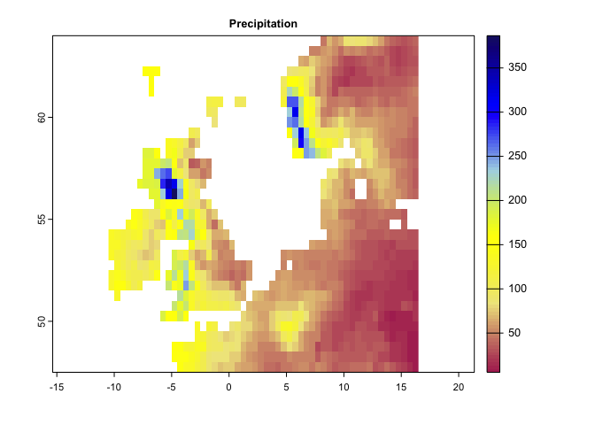

``` r
# color palette:
cl2 <- colorRampPalette (c("blue","Turquoise","Khaki","orange","darkred"))

plot(tmax[[1:4]],col=cl2(100))
```

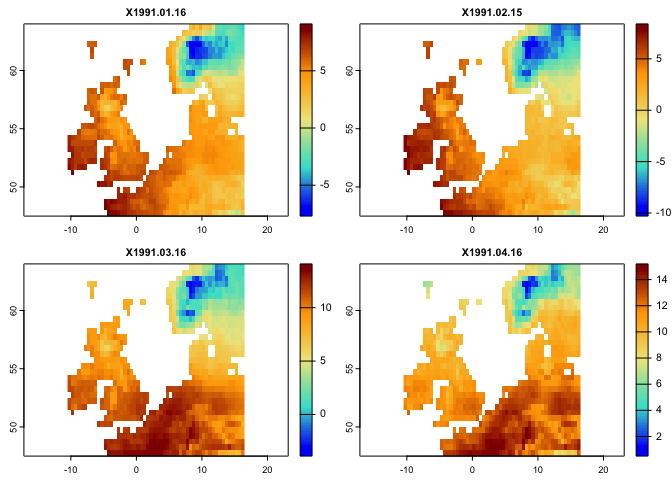

The climetrics works based on both raster or raster time series objects.
It would, however, easier to use raster time series. Here, you can see
how a raster time series can be created using the rts function in the
rts package. To do so, we need a vector holding (Date/time) with the
same length as the number of layers in the raster objects (i.e., the
dates correspond to layers). The class of the object should be “Date” or
“POCIXxx”. The corresponding dates to the above layers are already
available in the package:

``` r
n <- readRDS(paste0(filePath,'/dates.rds'))

class(n)
```

    ## [1] "Date"

``` r
length(n)
```

    ## [1] 360

``` r
head(n) # Dates corresponds to the layers in climate variables (pr, tmin, tmax, tmean)
```

    ## [1] "1991-01-16" "1991-02-15" "1991-03-16" "1991-04-16" "1991-05-16"
    ## [6] "1991-06-16"

``` r
####################
# In case if you want to know, how these Dates are created, just check the followin code:
# head(names(pr)) # names of the raster layers contain Date information
# n <- names(pr)
# n <- substring(n,2,11)
# head(n)
# n <- as.Date(n,format = '%Y.%m.%d')
######################

# use rts function in the rts package to make a raster time series:

pr.t <- rts(pr,n) 
tmin.t <- rts(tmin,n)
tmax.t <- rts(tmax,n)
tmean.t <- rts(tmean,n)
#------

plot(tmean.t[[1:4]],col = cl2(100))
```

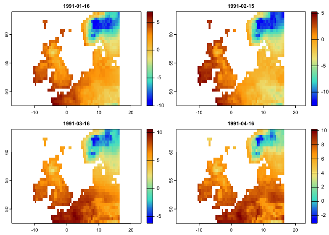

You can further explore the rts package by checking:
<https://github.com/babaknaimi/rts>

## climate change metrics

Here, we demonstrate how each metric can be quantified using the
climetrics R package. We use the raster time series data (loaded above)
for precipitation, minimum, mean, and maximum temperature. We considered
the years 1991-2000 as time 1 (t1), and 2010-2000 as time 2 (t2).
Therefore, the metrics compare the changes of climate condition between
time 2 and time 1.

### Changes in the probability of local climate extremes (localExtreme)

This metric can be quantified based on one or two climate variables. For
each variable, we need to specify the percentile of extreme values. For
example, this value can be 0.05 for precipitation, means the values
below the percentile of 0.05 would be considered as extreme condition.
It can be 0.95 for temperature, meaning that the values greater that the
temperature corresponds to 0.95 percentile, represents extreme
condition.

Here, we used the monthly raster time series data (as they were loaded
in the above sections) for precipitation and maximum temperature:

Note: these calculations captured one single aspect of extreme climates
(hot and dry), but other aspects could be calculated in a similar
manner.

``` r
# This code generates a map of probability of extreme climate events. 

lce <- localExtreme(tmean.t , pr.t,
                        t1 = '1991/2000', 
                        t2 = '2010/2020', 
                        extreme = c(0.95,0.05)) 

# as you can see from the code, when the input climate variables are raster time series,
# you can easily specify the range of time periods in t1 and t2

# Extreme is 95th and 5th percentiles corresponds to tmean.t, and pr.t (first and second arguments)


# let's first specify an appropriate color Pallete:
cl <- colorRampPalette(c("MidnightBlue","Turquoise","lightblue","gray","khaki","orange","red","Maroon"))


plot(lce,col=cl(100),main='Changes in Probability of Local Climate Extremes')
```

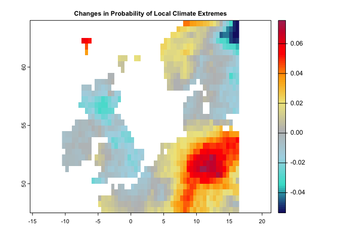

### Novel Climate

The following code generates Novel climates between the baseline
(1991-2000) and the second time period (2010-2020):

``` r
# This code generates a map of novel climates  1951-1980 and the second period is from 1981-2020

nc <- novelClimate(pr.t,tmin.t,tmax.t,t1='1991/2000',t2='2010/2020')

plot(nc,main='Novel Climate',col=cl2(100))
```

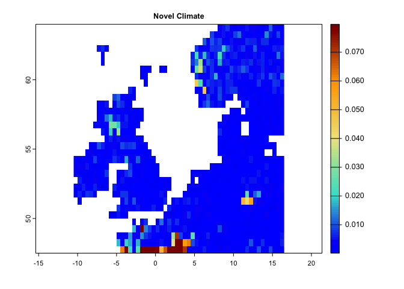

### Standardized Local Anomalies

This code generates a map for standardized local anomalies. The map
quantifies local changes in magnitude. The temporal differences for each
climate parameter were standardized using the local inter-annual
(baseline 1951-1980) standard deviation for that parameter. High
standardized local anomaly scores correspond to large changes in
temperature and precipitation.

``` r
se <- sed(pr.t,tmin.t,tmax.t,t1='1991/2000',t2='2010/2020') 

plot(se, col = cl2(100), main='Standardized Local Anomalies')
```

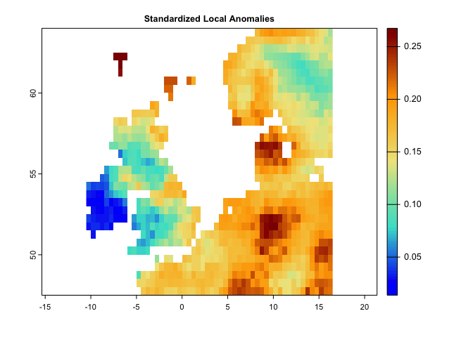

### Changes in the Area/Distance of/to Analogous Climate

There are two metrics that compare analogous climate between two times.
One metric (aaClimate) measures changes in the area of, and the other
metric (daClimate) measures the distance to analogous climate. So, for
each cell, aaClimate measures what is the ratio (in percentage) of
change in area of the given climate class in time 2 and time 1. The
daClimate metric quantifies the distances to all cells with analogous
climates in the time 1 period, i.e., belonging to the same climate class
of the given cell. It also quantifies the distances to all cells that
experience analogous climates in the time 2. Then, for each cell, it
calculates the median of the great-circle distances (in km) below the
10th percentile of the distribution of all values, for both time 1 and
time 2 periods, and maps the change over time. Negative values indicated
a temporal decrease in distance, whereas positive values indicated an
increase.

In order to calculate aaClimate and daClimate metrics, the input
variables need to be in the form of climate classes (i.e., a categorical
variable representing climate zones/classes). In the climerics package,
the kgc function is implemented to classify the climate variables based
on the Koggen-Geiger climate classification and identify that climate
zones (the function generates climate). However, if the input data are
provided as climate time series datasets (the same as those used for the
above metrics), the functions, first generate Koggen-Geiger climate
classes for time 1 and time 2, then measure the metrics.

Following is the example to use the time series of climate variables as
the input:

``` r
da <- daClimate(precip = pr.t, tmin = tmin.t, tmax = tmax.t, tmean = tmean.t, 
                t1='1991/2000',t2='2010/2020')

cl <- colorRampPalette(c("MidnightBlue","blue","Turquoise","lightblue","gray","yellow","red"))

plot(da,col=cl(100),main='Changes in Distance to Analogous Climate')
```


``` r
#----------
aa <- aaClimate(precip = pr.t, tmin = tmin.t, tmax = tmax.t, tmean = tmean.t, 
                t1='1991/2000',t2='2010/2020')

cl <- colorRampPalette(c("black","darkblue","MidnightBlue","blue","Turquoise","lightblue","gray","yellow","Maroon"))

plot(aa,col=cl(100),main='Changes in Area of Analogous Climate')
```


In the following example, we first use the kgc function to generate the
Koggen-Geiger climate classes. kgc needs the mean climate variables
taken over time series for different months, so for each month we need
to take the mean separately (e.g., mean precipitation for January,
February, etc.). To generate such dataset from the time series we have,
we can use the apply.months function that apply any function (e.g.,
mean) over each month of the time series:

``` r
# Let's apply mean over the subset of precipitation time series for time1 and time2:
p12.1 <- apply.months(pr.t[['1991/2000']],'mean')
p12.2 <- apply.months(pr.t[['2010/2020']],'mean')

p12.1 # this is the the mean precipitation for 12 months (time 1)
```

    ## class       : SpatRaster 
    ## dimensions  : 33, 54, 12  (nrow, ncol, nlyr)
    ## resolution  : 0.5, 0.5  (x, y)
    ## extent      : -10.5, 16.5, 47.5, 64  (xmin, xmax, ymin, ymax)
    ## coord. ref. : lon/lat WGS 84 (EPSG:4326) 
    ## sources     : memory  
    ##               memory  
    ##               memory  
    ##               ... and 9 more source(s)
    ## names       :    Jan,    Feb,    Mar,    Apr,    May,    Jun, ... 
    ## min values  :  17.36,  17.57,  23.84,  22.25,  28.05,  45.86, ... 
    ## max values  : 431.37, 351.92, 317.03, 223.55, 166.21, 180.81, ...

``` r
plot(p12.1, col=cl1(100))
```

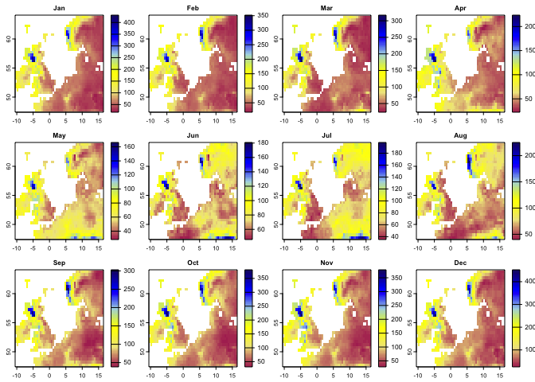

``` r
#--
tmin12.1 <- apply.months(tmin.t[['1991/2000']],'mean')
tmin12.2 <- apply.months(tmin.t[['2010/2020']],'mean')
#--
tmax12.1 <- apply.months(tmax.t[['1991/2000']],'mean')
tmax12.2 <- apply.months(tmax.t[['2010/2020']],'mean')
#--
tmean12.1 <- apply.months(tmean.t[['1991/2000']],'mean')
tmean12.2 <- apply.months(tmean.t[['2010/2020']],'mean')
```

After taking the mean climate variables for 12 months, we can use the
kgc function to generate the Koggen-Geiger climate classes for time 1
(1990-2000) and time 2 (2010-2020):

``` r
k1 <- kgc(p=p12.1,tmin = tmin12.1,tmax=tmax12.1, tmean = tmean12.1)

k2 <- kgc(p=p12.2,tmin = tmin12.2,tmax=tmax12.2, tmean = tmean12.2)


plot(k1, type='classes', col=rainbow(10), 
     main= "Koggen Geiger climate classification - 1990/2000")
```

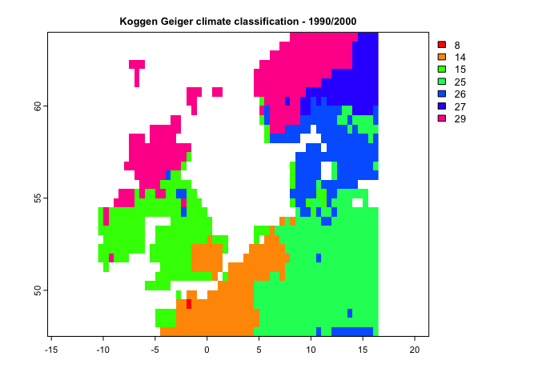

``` r
plot(k2,  type='classes', col=rainbow(10), 
     main= "Koggen Geiger climate classification - 2010/2020")
```

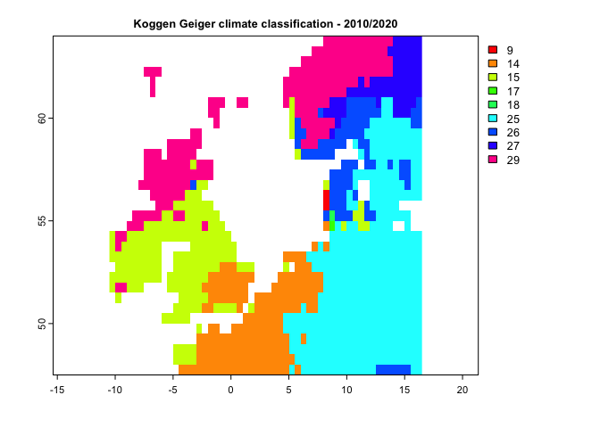

By having climate classes, you can use aaClimateC or daClimateC
functions to calculate the Area/Distance of/to Analogous Climate
metrics:

``` r
aa <- aaClimateC(k1, k2)

cl <- colorRampPalette(c("black","darkblue","MidnightBlue","blue","Turquoise","lightblue","gray","yellow","Maroon"))

plot(aa,col=cl(100),main='Changes in Area of Analogous Climate')
```

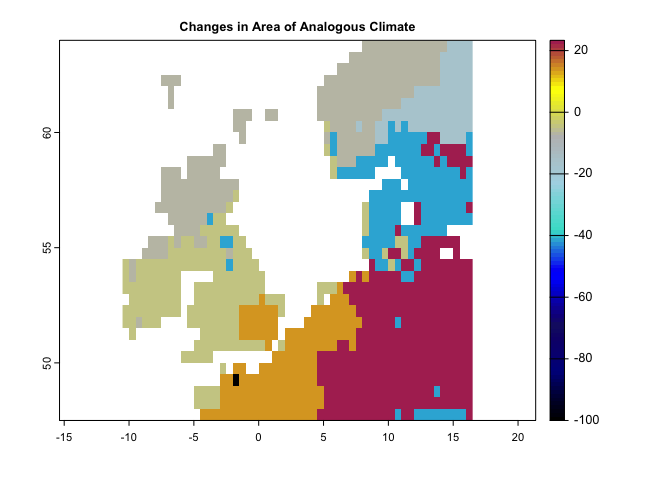

``` r
#----
da <- daClimateC(k1, k2)

cl <- colorRampPalette(c("MidnightBlue","blue","Turquoise","lightblue","gray","yellow","red"))

plot(da,col=cl(100),main='Changes in Distance to Analogous Climate')
```

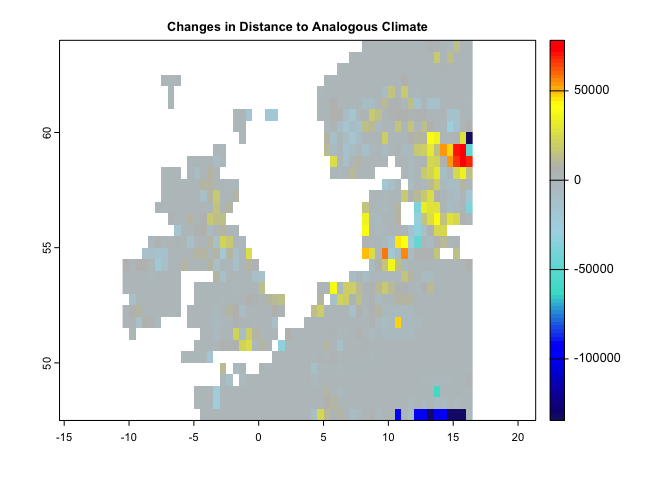

### Velocity of Climate Change

Several velocity metrics are implemented in climetrics, that are
accessible through the functions of velocity, dVelocity, and gVelocity.
Please check the help page of each function for the details about the
method and the reference used to implement each function. Here, the
following examples demonstrate how we can use each function.

#### The velocity function:

This method works based on two climate variables. Let’s run it based on
precipitation and mean temperature:

``` r
ve <- velocity(x1=pr.t,x2=tmean.t,t1='1991/2000',t2='2010/2020')

plot(ve, col=hcl.colors(100), main='Velocity of Climate Change')
```

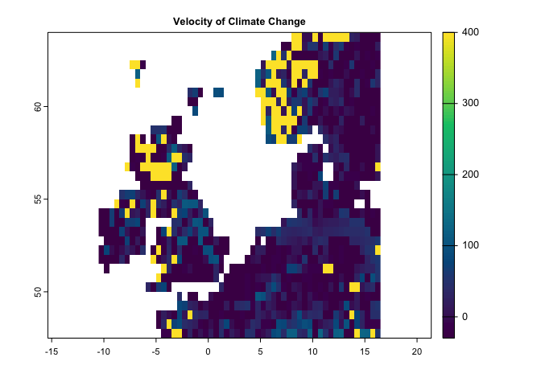

#### The dVelocity function:

This method is a distance-based velocity that can be quantified based on
one or multiple climate variables:

``` r
dv <- dVelocity(pr.t,t1='1991/2000',t2='2010/2020')
plot(dv,col=hcl.colors(100), 
     main='Distance-based Velocity of Climate Change for Precipitation')
```

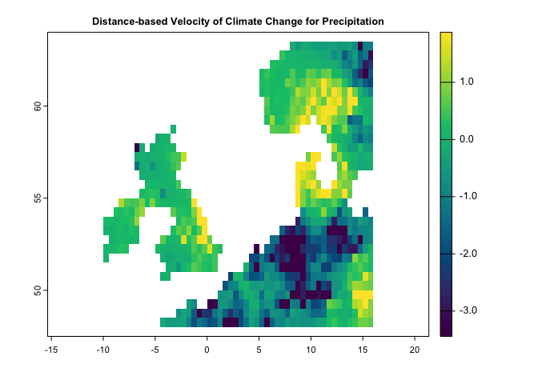

``` r
dv <- dVelocity(pr.t,tmin.t,tmax.t,t1='1991/2000',t2='2010/2020')

plot(dv,col=hcl.colors(100), 
     main='Distance-based Velocity of Climate Change for multiple climate variabels')
```

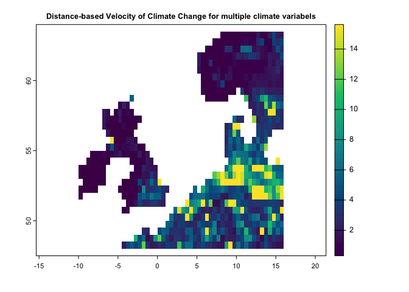

#### The gVelocity function:

This method is a gradiant-based velocity that can be quantified based on
a single climate variable:

``` r
gv <- gVelocity(pr.t) 

cl <- colorRampPalette(c("MidnightBlue","Turquoise","lightblue","gray","khaki","orange","red"))

plot(gv, col=cl(100), main='Gradiant-based Velocity for Precipitation')
```

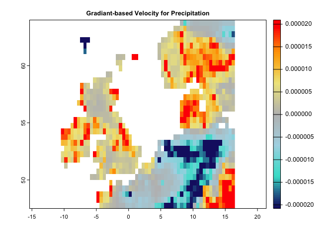

## Aditional tools

#### Quantify multiple climate change metrics using the ccm function:

There is another function, ccm, that make it possible to quantify
eaither (or several) of the metrics through a single function. You only
need to provide any specific argument that is required for a certain
metric to the function (e.g., extreme argument for the localExtreme
metric)

``` r
# Following code generates climate 3 metrics including:
# -------------- (localExtreme, Standardized Local Anomalies, and Novel Climate)
# just pay attention that the extreme argument is added for the lce metric
c3 <- ccm(pr.t,tmax.t,t1='1991/2000',t2='2010/2020',
          stat=c('lce','sed','nc'), extreme = c(0.05, 0.95))

plot(c3,col=cl2(100))
```

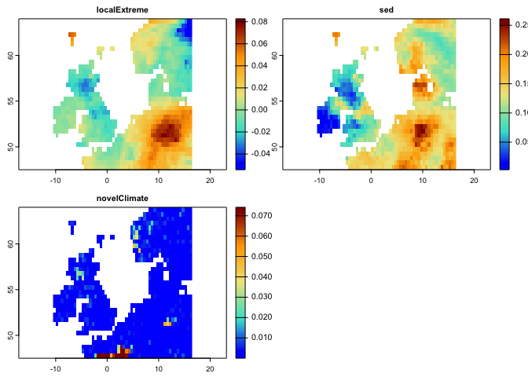

``` r
# Following code generates climate 2 velocity metrics:
ve <- ccm(pr.t,tmean.t,tmax.t,t1='1991/2000',t2='2010/2020',stat=c('dVe','gVe'))
```

    ## 
    ## gVelocity is calculated for a single climate variable. Since multiple variables are provided, average velocity is returned!

``` r
plot(ve,col=hcl.colors(100))
```

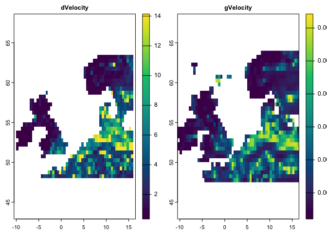

#### Some other flexibilities in the package (optional):

In case if the time series is a raster object, you can use the functions
without first generating the raster time series. The only thing is that
you need to know which layers belong to time 1 and time 2 (by
introducing a numeric vector that specifies the layer numbers):

``` r
# pr and tmax are SpatRaster object:

pr 
```

    ## class       : SpatRaster 
    ## dimensions  : 33, 54, 360  (nrow, ncol, nlyr)
    ## resolution  : 0.5, 0.5  (x, y)
    ## extent      : -10.5, 16.5, 47.5, 64  (xmin, xmax, ymin, ymax)
    ## coord. ref. : lon/lat WGS 84 (EPSG:4326) 
    ## source      : precip.tif 
    ## names       : X1991.01.16, X1991.02.15, X1991.03.16, X1991.04.16, X1991.05.16, X1991.06.16, ... 
    ## min values  :    5.600000,    9.800000,   12.300000,    8.800000,    1.700000,   49.600002, ... 
    ## max values  :       386.5,       199.9,       297.0,       337.6,       197.9,       244.4, ...

``` r
# we know that the layers of 1:120 corresponds to the period of 1991-2000,
# and the layers of 229:360 correspond to the period of 2010-2020

# so the following code works based on the Raster object (not raster time series):
le <- localExtreme(pr,tmax,t1=c(1:120),t2=c(229:360),extreme = c(0.05, 0.95))

plot(le,col=cl2(100))
```

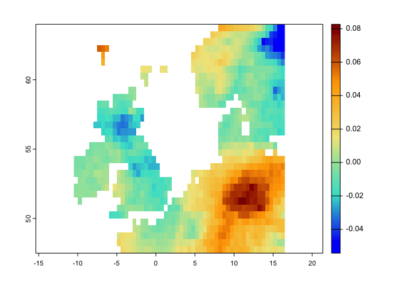

In case if we have separate raster objects for time 1, and time 2, we
can still use the climetrics package:

``` r
# Here, we just take layers for t1 and t2 as separate Raster objects to demonstrate an
# example where the datasets for t1 and t2 are separate:

pr1 <- pr[[1:120]] # precipitation for t1 

pr2 <- pr[[229:360]] # precipitation for t2

tmax1 <- tmax[[1:120]]
tmax2 <- tmax[[229:360]]

# so now let's quantify the SED:
se <- sed(t1=list(pr1,tmax1),t2=list(pr2,tmax2))

plot(se, col = cl2(100), main='Standardized Local Anomalies')
```

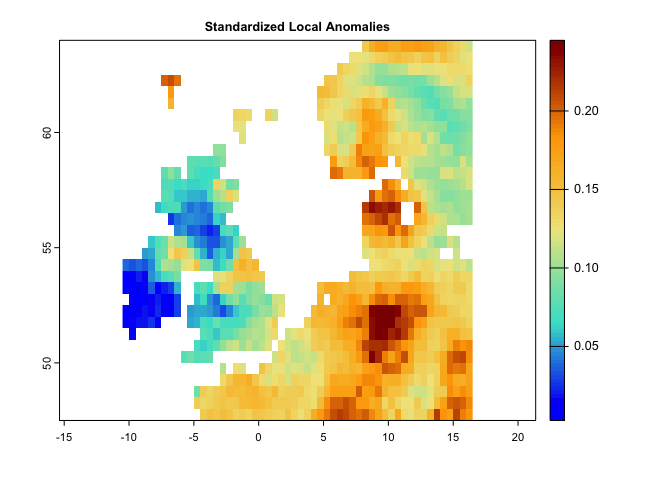
